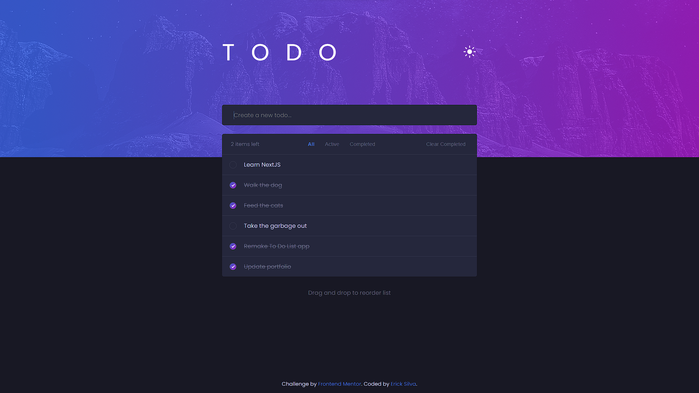

# TO DO LIST

In this project, I created a dynamic to-do list witch items can be added, deleted and moved. The tasks are saved in the localStorage and can be seen in the same way in a new visit to the page.

_This project was developed based on [Frontend Mentor's challenge](https://www.frontendmentor.io/challenges/todo-app-Su1_KokOW)_



## Main technologies that I used

- [ReactJS](https://reactjs.org/)
- [Sass](https://sass-lang.com/)
- [Formik](https://formik.org/docs/overview)
- [react-beautiful-dnd](https://github.com/atlassian/react-beautiful-dnd)

## How to run in your machine

### 1. Clone this repository

```zsh
git clone git@github.com:ericksilvadev/todo-list-2.0.git todo-list
```

### 2. Go to the repository you just created

```zsh
cd todo-list
```

### 3. Install the dependencies

yarn:

```zsh
yarn
```

npm:

```zsh
npm install
```

### 4. Open the app

yarn:

```zsh
yarn dev
```

npm:

```zsh
npm run dev
```
